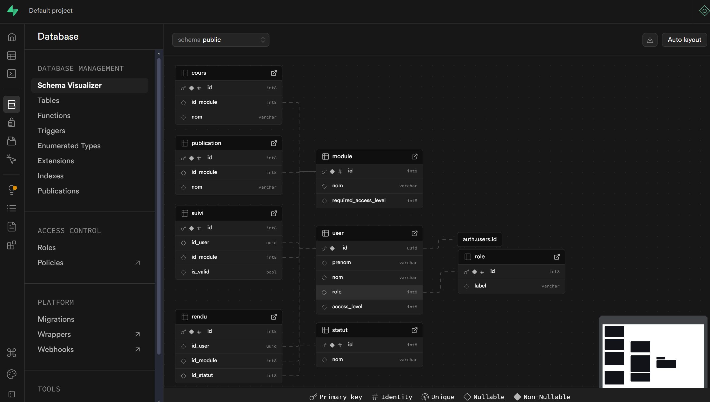
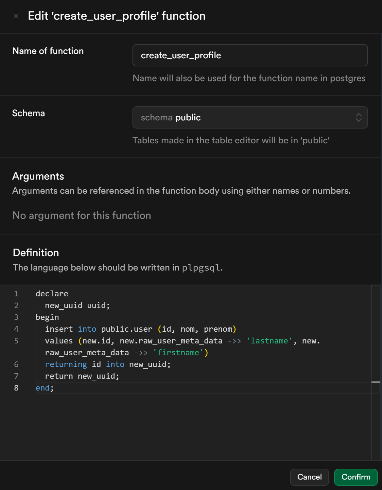
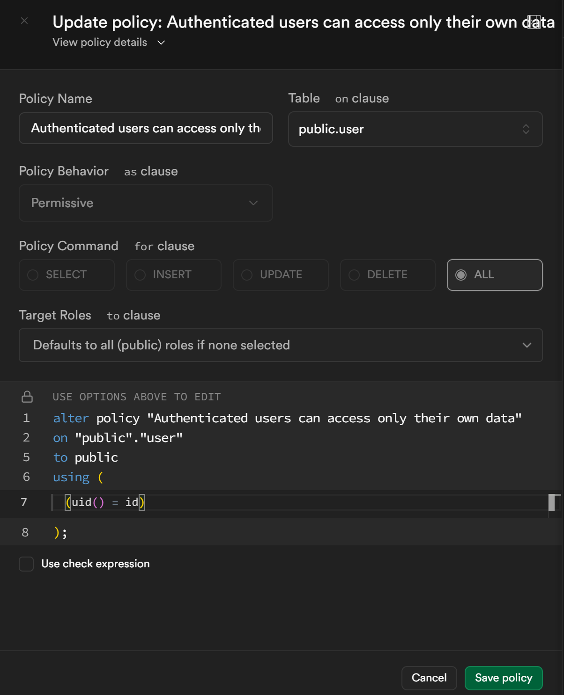
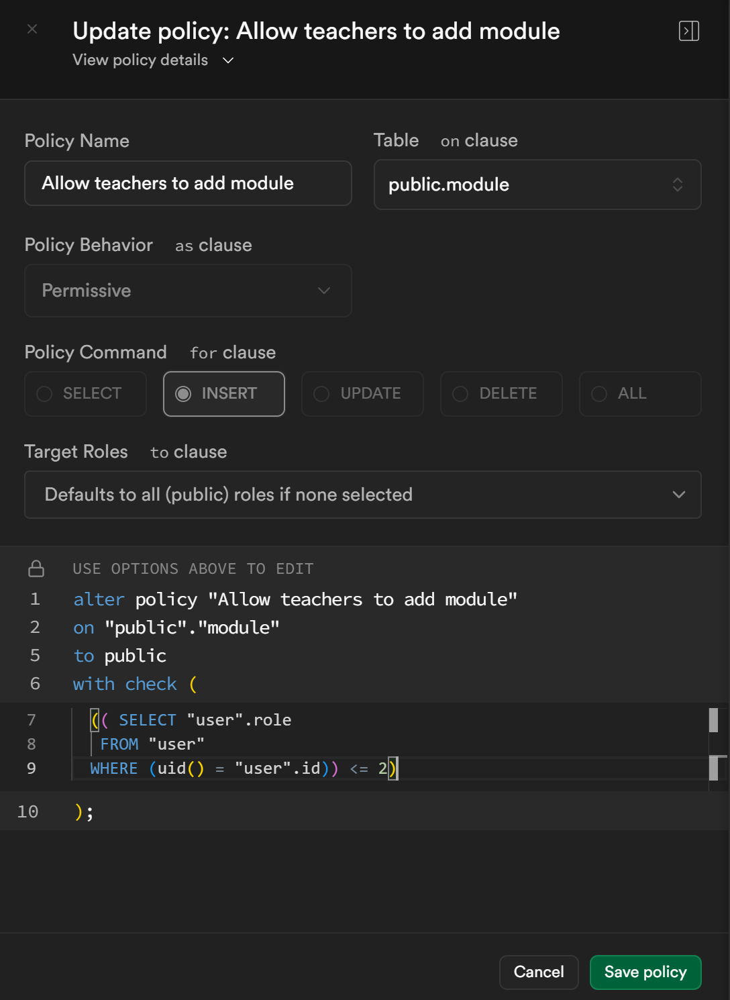
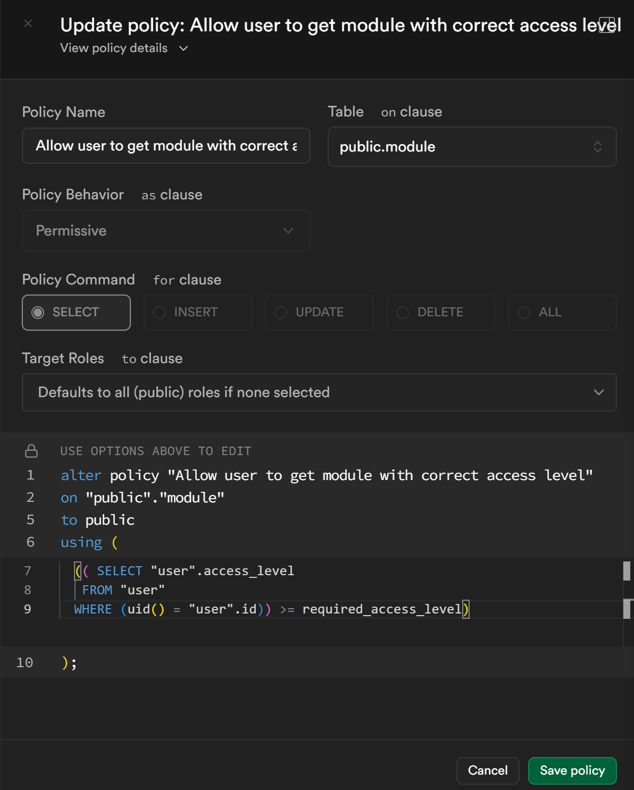

# Epsilon

## Introduction

This project was carried out as part of our studies. This application allows students to participate in modules/training sessions and submit work. While teachers can create modules and collect students' work for correction and grading. Its aim is to introduce the concept of TPAM (Third Party Application Maintenance) & AM (Application Maintenance).
We have to develop part of the application and then exchange it with another group who has to finish it.

## Installation

Clone this repos
```bash
git clone https://github.com/DCodeProg/flutter_epsilon_v2.git
cd flutter_epsilon_v2
```

Rename .env.exemple to .env and setup it.

Install requirements dependencies
```bash
flutter pub get
```

Run it !
```bash
flutter run
```

## Database

### UML
Here's our UML, inspired by the one our teacher gave us. We've only extracted what's necessary.



### Functions
We made a function which for each user created (users tables in the supabase auth schema), will create their public profile (user table in the public schema).



### Policies
*We have also added accessibility policies for some tables.*

#### Users

Each user has all rights for his account.



#### Modules

A person can only see modules that have an access level lower than or equal to their level



<br>
A person can create modules only if he is an admin or teacher.


